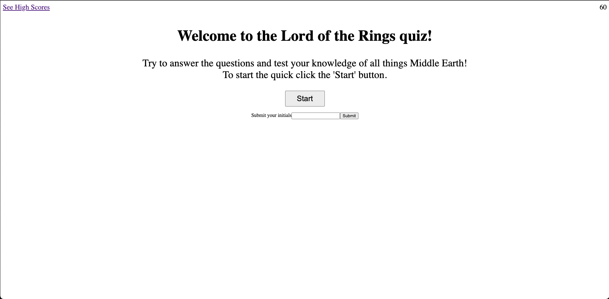

# mod4-challenge

In this challenge we were tasked to create a quiz from scratch using Javascript and to use our knowledge of eventlisteners, conditionals, for loops, objects, arrays, and localstorage. The most trouble I had was being able to select an answer and validate if that was correct. Im still having trouble getting my local storage to render and to get the game to end properly when all the questions are answered. I still feel proud of what I was able to create considering it was created from scratch.

## User Story

- AS A coding boot camp student
- I WANT to take a timed quiz on JavaScript fundamentals that stores high scores
- SO THAT I can gauge my progress compared to my peers

## Acceptance Criteria

- GIVEN I am taking a code quiz
- WHEN I click the start button
- THEN a timer starts and I am presented with a question
- WHEN I answer a question
- THEN I am presented with another question
- WHEN I answer a question incorrectly
- THEN time is subtracted from the clock
- WHEN all questions are answered or the timer reaches 0
- THEN the game is over
- WHEN the game is over
- THEN I can save my initials and score

